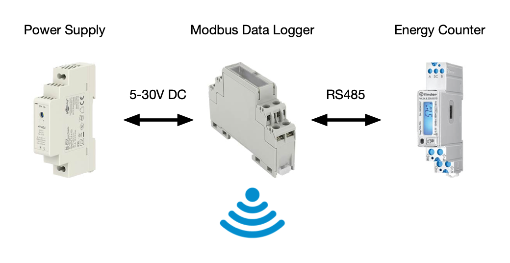

# Modbus Data Logger

## Description

This is a project for a DIN rail Modbus Data Logger. The idea was to record the energy production of a photo voltaic installation using a data logger that also works offline. The data logger will read values off the energy counter at regular intervals. The values are then stored with a time stamp on the SD card. The log files can later be retrieved via a WiFi access point.

## Build

This software is build using [PlatformIO Core](https://docs.platformio.org/en/latest/core/installation/methods/installer-script.html). Once you have installed the PIO binaries you can execute `pio run` to build the firmware and `pio run -t upload` to flash the firmware onto the ESP32 S3. Please take a look at `platformio.ini` for the additional libraries this project depends upon. On Linux/macOS feel free to use the Makefile wrapper to start the build. 
