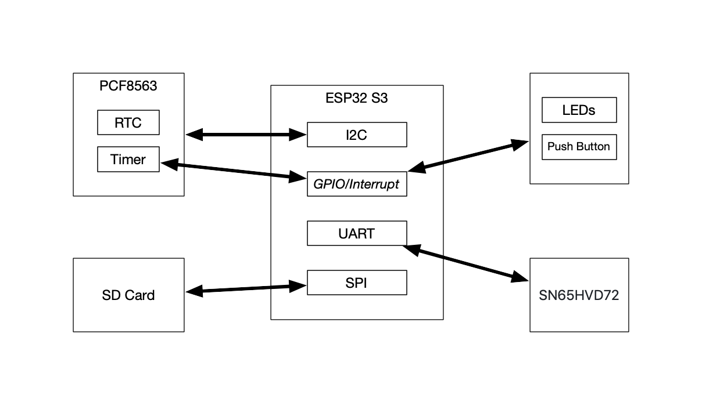
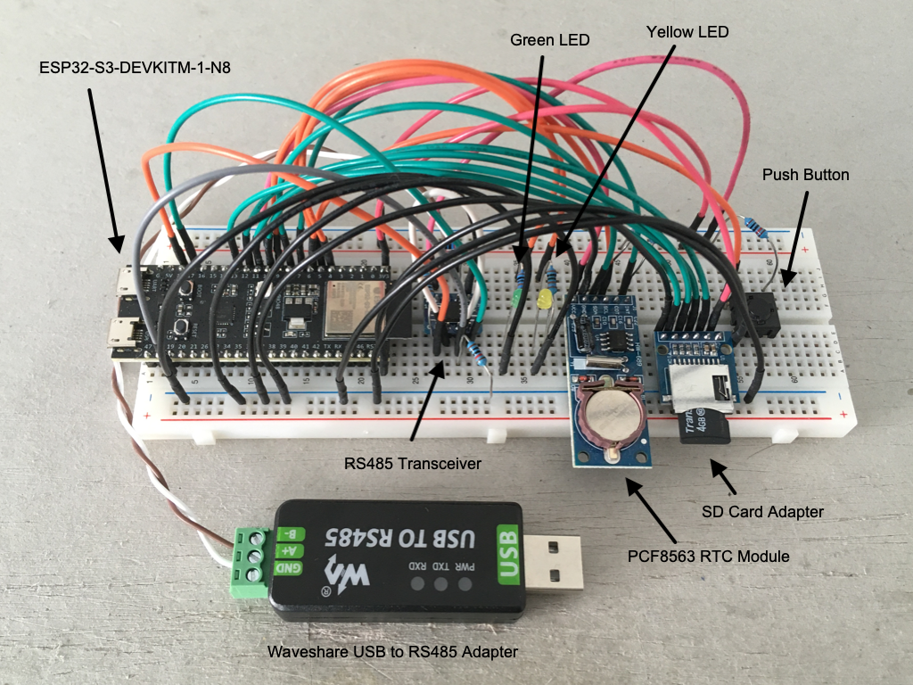

# Architecture

The image below shows the basic configuration of the hardware:

## PCF8536

The PCF8563 contains the RTC (Real Time Clock) and a timer running at 1/60 Hz. It is important to note that the timer is the scheduler for the system. It generates a GPIO interrupt to wake and/or trigger the ESP32 to read values via Modbus.

## GPIO

The push button toggles Wifi on and off. The yellow LED indicates the Wifi status. Without Wifi running the ESP32 goes into deep sleep between reading Modbus values to conserve energy. The green LED blinks whenever values are successfully read via Modbus and written to the SD card.

## SN65HVD72

The SN65HVD72 is the RS485 differential driver used to read values off the energy counter via Modbus. It is connected to one of the three available UARTs (Universal Asynchronous Receiver Transmitter) of the ESP32 S3.

## SD Card

The SD card is connected via SPI (Serial Peripheral Interface) to the ESP32. It's formated using FAT32 file system. 

## Breadboard

I used the following development components to test the hardware setup:

  