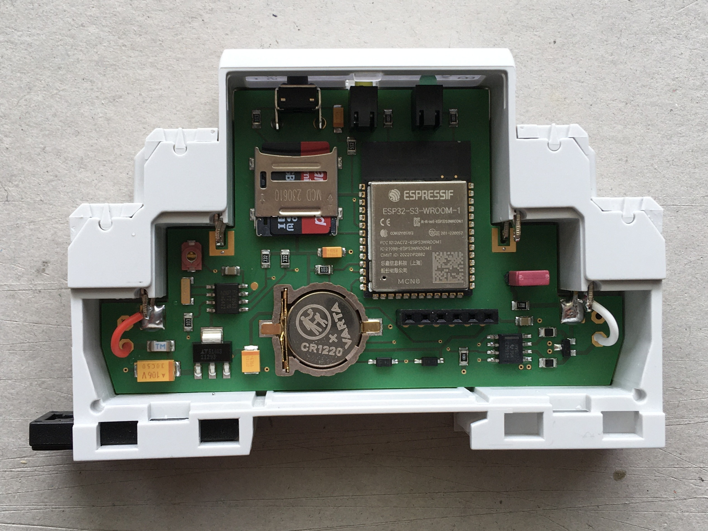
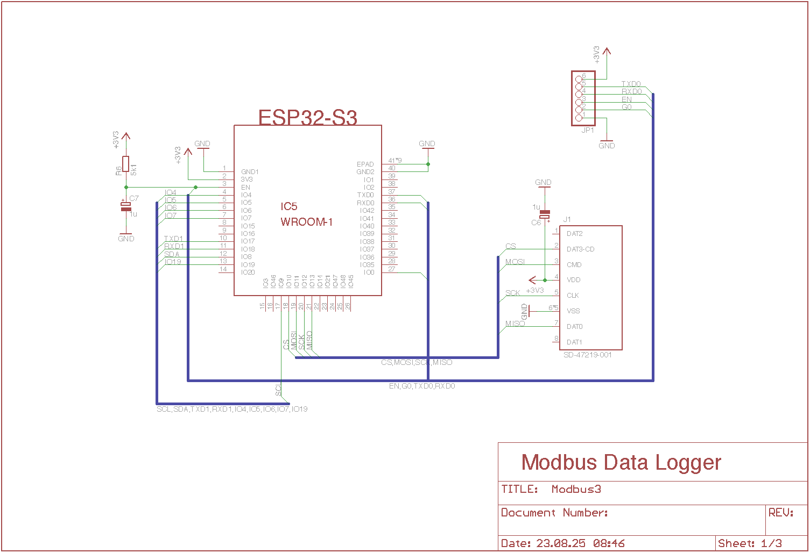
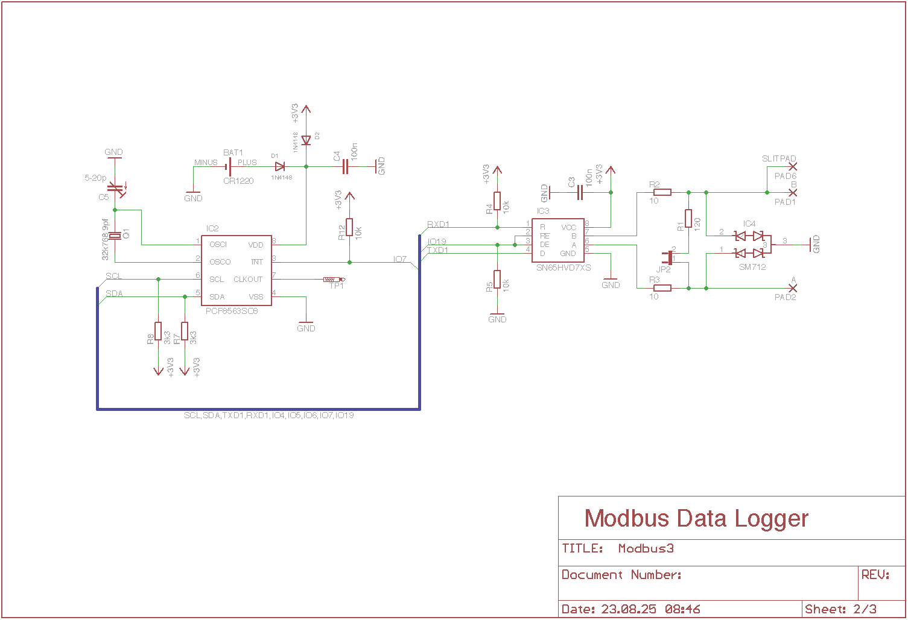
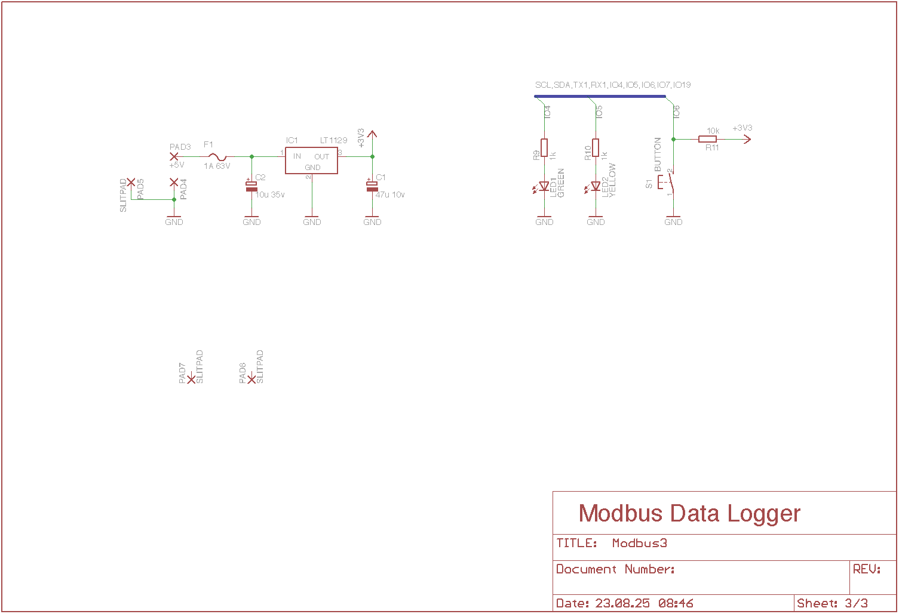
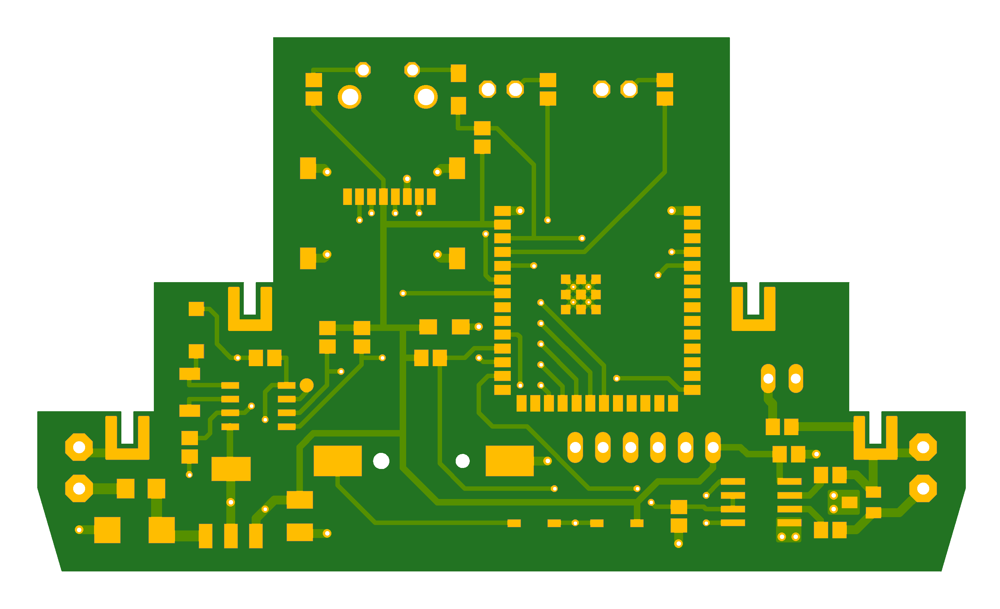
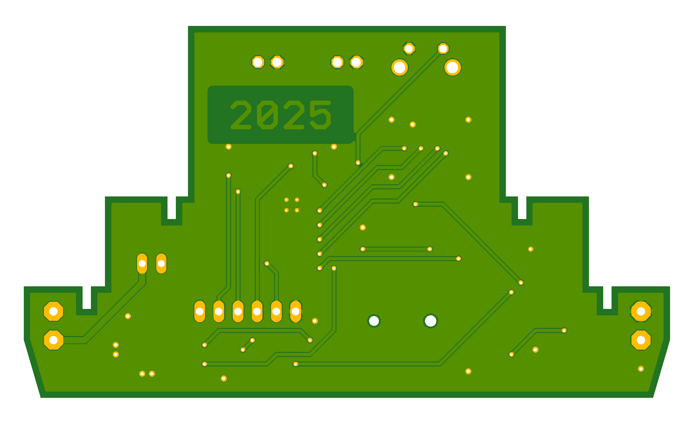

# Hardware

The data logger is based on an Espressif ESP32 S3 micro controller in a DIN rail enclosure. The controller is equipped with an SD card, real time clock, RS485 serial line driver and a linear voltage regulator capable of DC input voltages of 5-30 Volts. 

## Schematic

## Parts List

* 1 x CB PGKIT 1 (Camdenboss DIN rail enclosure)
* 1 x CR1220 (coin cell battery)
* 1 x CR1220 Holder (battery holder)
* 1 x 47u/10V (SMC_B polar tantalum capacitor) 
* 1 x 10u/35V (SMC_C polar tantalum capacitor)
* 2 x 1u (SMC_A polar tantalum capacitor)
* 2 x 100n (0805 ceramic capacitor)
* 1 x 10p (0805 ceramic capacitor)
* 2 x 1N4148 (SOD-123 small signal switching diode)
* 1 x Fuse 1A/63V (1206 chip fuse)
* 1 x PCF8563 (SO8 real-time clock/timer)
* 1 x MAX3485 (SO8 RS-485/RS-422 transceiver)
* 1 x LT1129 (SOT-223 low dropout voltage regulator)
* 1 x SM712 (SOT-23-3 asymmetrical TVS diode array)
* 1 x ESP32-S3-WROOM-1 (dual-core 32-bit LX7 microprocessor)
* 1 x SD Card 16GB
* 1 x SD Card Holder (Molex SD-47219-001)
* 1 x Pinheader 1x6 (2.54mm pitch)
* 1 x LED Green (Dialight 551-xx07 3mm LED)
* 1 x LED Yellow (Dialight 551-xx07 3mm LED)
* 1 x Quarz 32k768 (Euroquarz EQ162 12.5pF crystal)
* 4 x 10k Ohm (0805 resistor)
* 1 x 5k1 Ohm (0805 resistor)
* 2 x 4k7 Ohm (0805 resistor)
* 2 x 3k3 Ohm (0805 resistor)
* 1 x 120 Ohm (0805 resistor)
* 1 x Tactile Switch (NAMAE JTP 1236)

## ESP32 M5Stack Downloader Pinout

<pre>
ESP32   M5Stack
---------------
GND   <->  GND
IO0   <->  G0
EN    <->  EN
RXD0  <->  TXD
TXD0  <->  RXD
DD33  <->  3.3V
</pre>

## PCB

## Usage

