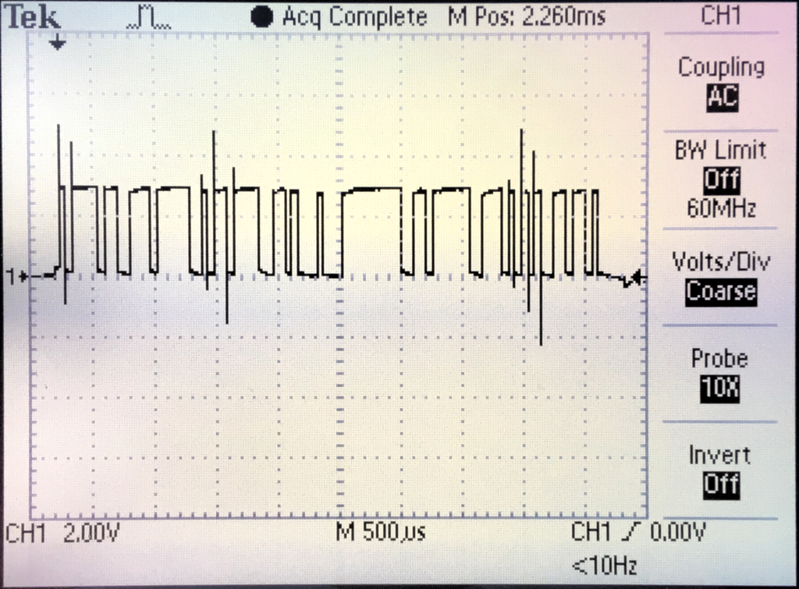
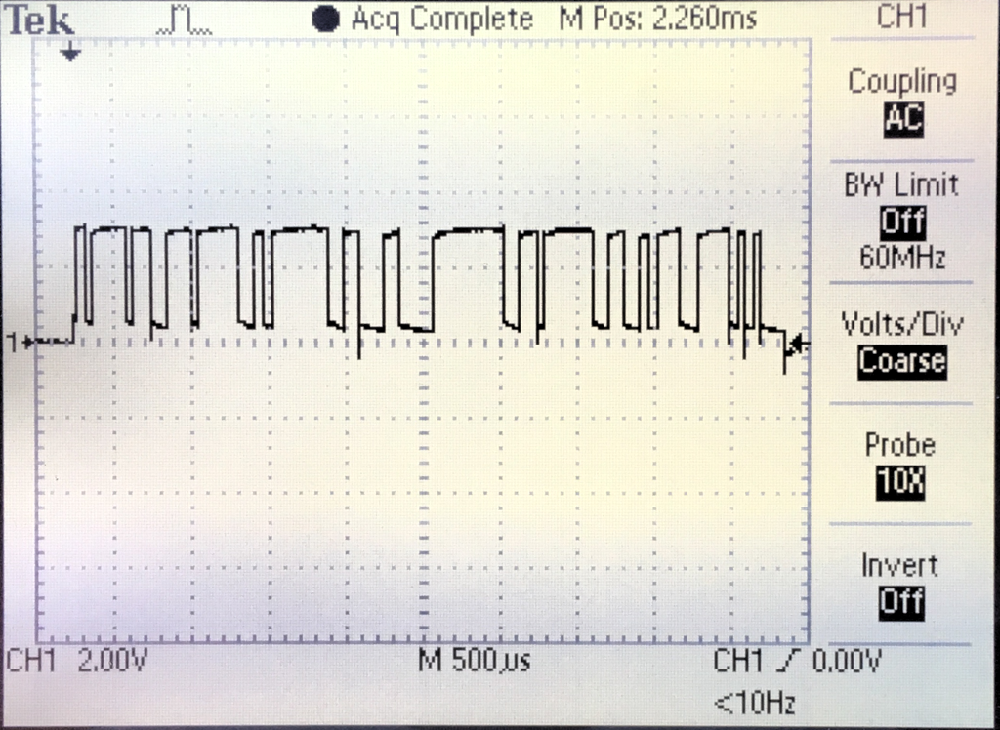

# RS485

After running into some issues setting up the RS485 connection between the data logger and the Finder energy meter (I had to adjust bias resistors) I did some online searching. Texas Instruments has a really nice [article](https://www.ti.com/lit/an/slyt514/slyt514.pdf) online explaining failsafe biasing and the differences between legacy and newer RS485 transceivers. After reading that I decided to test the SN65HVD72 and compare it to the MAX3485. The first positive thing to note is the SN65HVD72 is available in a pin compatiple SO8 package and it runs on 3.3 volts just like the MAX3485. I plugged both transceivers into my breadboard test setup with one 120 Ohm load resistor and no bias resistors. Below you can see a test signal for both transceivers:

## MAX3485

## SN65HVD72

The thing that stood out to me is how much cleaner the signal of the SN65HVD72 is (a lot fewer spikes). I wish I could test the SN65HVD72 in a larger network to see how it behaves with a lot more transceivers but for now my simple test setup will have to do.