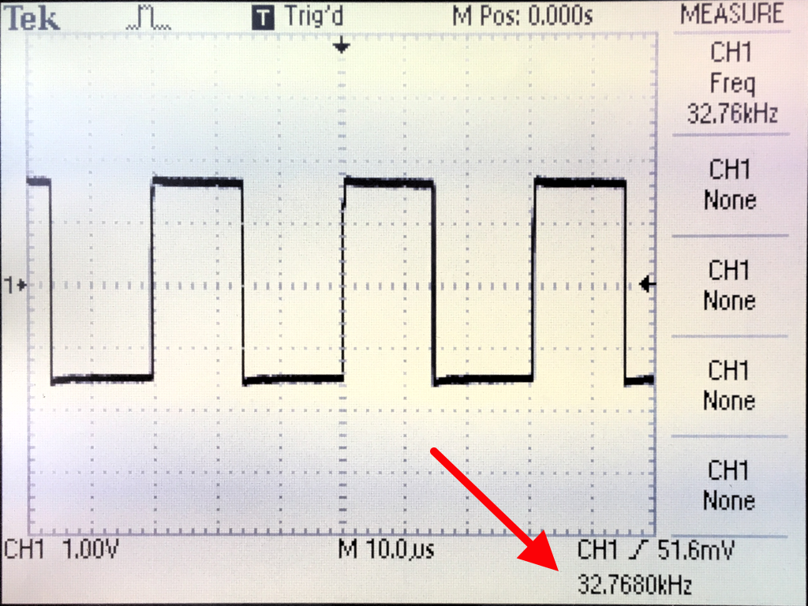

# Real Time Clock
With the trimmer capacitor C5 I was able to adjust the PCF8563 oscillator frequency (32.768 kHz) to about 1/10th of a Herz. This should result in an error of less than +- 1 minute per year for the RTC (good enough for me :-) ). To measure the frequency I had to enable CLKOUT for the PCF8563 (please see [Timer_PFC8563.cpp](../src/Timer_PFC8563.cpp) for details). Using a pull up resistor connected to TP1 (Test Pad 1) you can then measure the frequency without affecting the oscillator.

