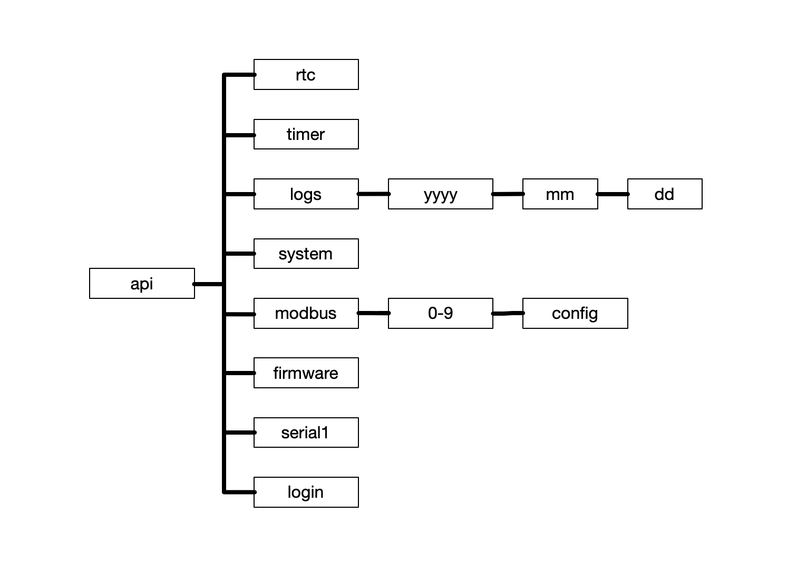

# REST API

After experimenting with a ftp/telnet server for a while it soon dawned on me that the ESP32 wants to programmed using a web server. I never liked the way most programms mix code and html. After some searching I rediscoverd an oldie but goodie: The [REST](https://en.wikipedia.org/wiki/REST) API (Application Programming Interface). It as some nice features like being client/server, stateless and more. It's also loosely based on the [CRUD](https://en.wikipedia.org/wiki/Create,_read,_update_and_delete) concept. The most important features for me include separating html and binary code. REST URLs can also easily be scripted. And if you have them work with JSON objects a web interface can be added on top. All examples below use the nifty [cURL](https://curl.se/) command line utility. 

## Overview

## RTC
The following GET queries the RTC (Real Time Clock) and returns the date in UTC (Universal Time Coordinates) epoch seconds.
<pre>
curl http://datalogger.local/api/rtc
1752140389
</pre>

The following PUT sets the date:
<pre>
curl -u "admin:admin" -X PUT -d "epoch=1747931902" http://datalogger.local/api/rtc
</pre>

## Timer
The following GET returns the timer value in minutes. The timer of the PCF8563 RTC is the scheduler waking the ESP32 at regular intervals to read values via Modbus. It is an 8 bit timer clocked at 1/60 Hz which results in an interrupt every 1 to 255 minutes (4 hours and 15 minutes max).
<pre>
curl http://datalogger.local/api/timer
1
</pre>

And the next PUT sets the timer value. A value of 0 disables the timer. The example below changes the timer interval to 5 minutes:
<pre>
curl -u "admin:admin" -X PUT -d "minutes=5" http://datalogger.local/api/timer
</pre>

## Logs
To get a list of all log files stored on the SD card the following GET returns a list of file ids and their size:
<pre>
curl http://datalogger.local/api/logs
20250202 16395
20250203 22488
20250204 22953
.
.
.
</pre>

Downloading a log file is a simple GET on the file id:
<pre>
curl http://datalogger.local/api/logs/20250421
20250421000000 54505 1221119 237 555788 0.2
20250421000100 54505 1221119 237 555791 0.2
20250421000200 54505 1221119 237 555793 0.3
.
.
.
</pre>

Uploading to an existing log file is a POST:
<pre>
curl -u "admin:admin" -F "file=@20250421" http://datalogger.local/api/logs/20250421
</pre>  

and deleting the log file is a POST on the following URL:
<pre>
curl -u "admin:admin" -X POST http://datalogger.local/api/logs/20250421/remove
</pre>

## Firmware
This POST uploads a firmware binary to the SD card to provide an OTA (Over The Air) upgrade capability. The ESP32 will try to install the firmware binary on the SD card as soon as it wakes up from deep sleep (please see the code for details). If the upgrade is successful the ESP32 will reboot. Otherwise it will keep on running with the current firmware.
<pre>
curl -u "admin:admin" -F "file=@firmware.bin" http://datalogger.local/api/firmware
</pre>

To check the version (GIT hash) currently running on the datalogger you can issue the following GET:
<pre>
curl http://datalogger.local/api/firmware
</pre>

## System

To get and change the Wifi SSID, Wifi password, http user and http password you can use the following statements. A GET returns all the configurable parameters:

<pre>
curl -u "admin:admin" http://datalogger.local/api/system
wifiSSID=Datalogger_5AB278&wifiPassword=&httpUser=admin&httpPassword=admin
</pre>

A PUT on one or multiple parameters changes the default settings. Remember changing the http password changes access to the REST API immediately. Changing the Wifi password requires rebooting the data logger (or waking it from deep sleep). Please also note a Wifi password needs to be at least eight characters in length. Otherwise the ESP will behave like it has no password set.

<pre>
curl -u "admin:admin" -X PUT -d "wifiPassword=12345678" http://datalogger.local/api/system
</pre>

To reset the system the following POST will load default values for all system, serial and modbus settings:
<pre>
curl -u "admin:admin" -X POST http://datalogger.local/api/system/reset
</pre>
You should also reset the system whenever you change the number of modbus configurations stored in NVS (Non Volatile Storage).

## Modbus

The following GET will list the number of available Modbus configurations. The number can be changed in the Settings.h header file. Please remember not to configure too many slots otherwise they will not fit into the NVS partition of the ESP32.
<pre>
curl http://datalogger.local/api/modbus
0
1
2
3
4
</pre>

A default configuration looks something like this. A device address of 0 and a value type named `FOO` means the configuration is not used.
<pre>
curl http://datalogger.local/api/modbus/0/config
deviceAddress=0&functionCode=0&amp;registerAddress=0&valueType=FOO
</pre>

The following PUT will set a configuration:
<pre>
curl -u "admin:admin" -X PUT -d "deviceAddress=33&functionCode=4&amp;registerAddress=462&valueType=T3" http://datalogger.local/api/modbus/0/config
</pre>

And with the following GET you can test if the configuration works. Remember to enable the scheduler (timer) once the configurations work the way you want for the values to be logged to the SD card.
<pre>
curl http://datalogger.local/api/modbus/0
55947
</pre>

## Serial1

Using the following GET you can view the serial port configuration driving modbus:
<pre>
curl http://datalogger.local/api/serial1
baud=19200&config=8N2
</pre>

And the following PUT changes the configuration of Serial Port 1. Remember to power cycle or wake the datalogger from deep sleep for the new values to take effect.
<pre>
curl -u "admin:admin" -X PUT -d "baud=9600&config=8N1" http://datalogger.local/api/serial1
</pre>
