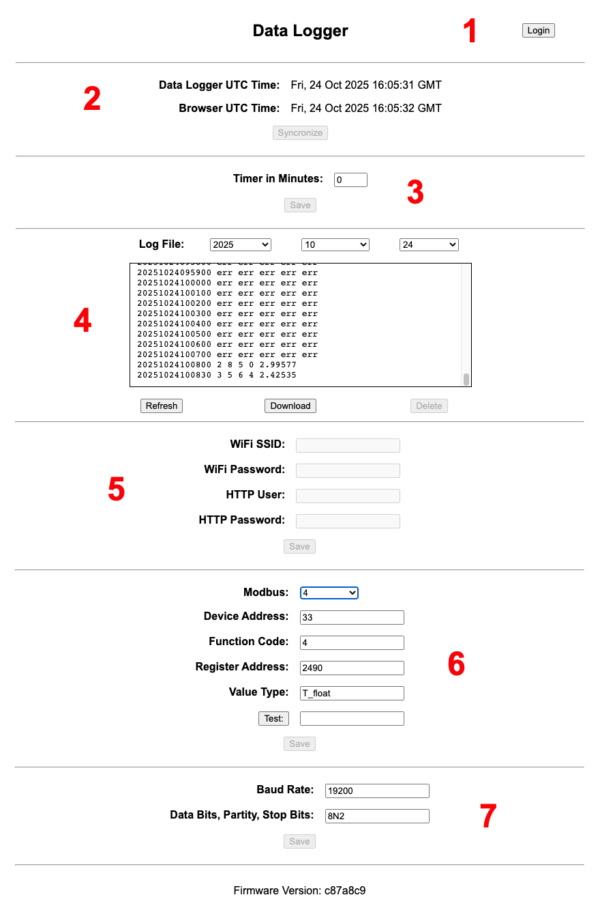

# Web Interface

The data logger has a simple web interface located in the SPIFFS partition of the ESP32. To install the web interface issue a `pio run -t buildfs`. The web interface is optional if the REST API is sufficient for you. To access the web interface connect to the WiFi AP (Access Point) and then direct your browser to: **http:://datalogger.local/**

## 1.
The login button in the header does a HTTP basic authentication for the admin user. You need to login to e.g. access the **Save** buttons.

## 2.
In section two you can synchronise the data loggers RTC (Real Time Clock) with the date and time of the computer where your browser is running. Synchronisation needs to be done once in a while to prevent the data loggers RTC from drifting too much.

## 3.
Here you can configure the scheduler (timer) of the system. The timer wakes the ESP from deep sleep to read modbus values and then go back to sleep. It is an eight bit timer (0-255 minutes). A value of zero disables the timer. It is usually a good idea to disable the timer whenever you configure new modbus slots.

## 4.
In section four you can take a look at the log files written to the SD card by selecting the year, month and day. You can also **Refresh**, **Download** and **Delete** a log file.

## 5.
In this section you can change the Wifi user and password and also the HTTP user and password. Please remember changing the HTTP user/password has an immediate effect (you have to reauthenticate). Changing the Wifi SSID and password will not take effect until you stop/start Wifi.

## 6.
Here you can configure all the modbus registers the data logger periodically queries. A lot of features here don't work yet as of now. For example you can only use **Function Code 4**. And most of the Finder value types have not been implemented (only T1, T2, T3 and T_float). You can use the **Test** button to verify configurations. A device address of zero will mark the configuration as unused.

## 7.
And last but not least you can set the UART parameters used for modbus communication. These values depend on the bus you are connecting to. Default Finder energy meter values are **19200** baud, eight data bits, no parity and two stop bits (**8N2**). Please remember you can terminate modbus with 120 Ohms by opening or closing the jumper on the right side of the PCB (Printed Circuit Board). The data logger is a modbus client (also called master). Changing the UART parameters will only take effect after stop/starting Wifi.
